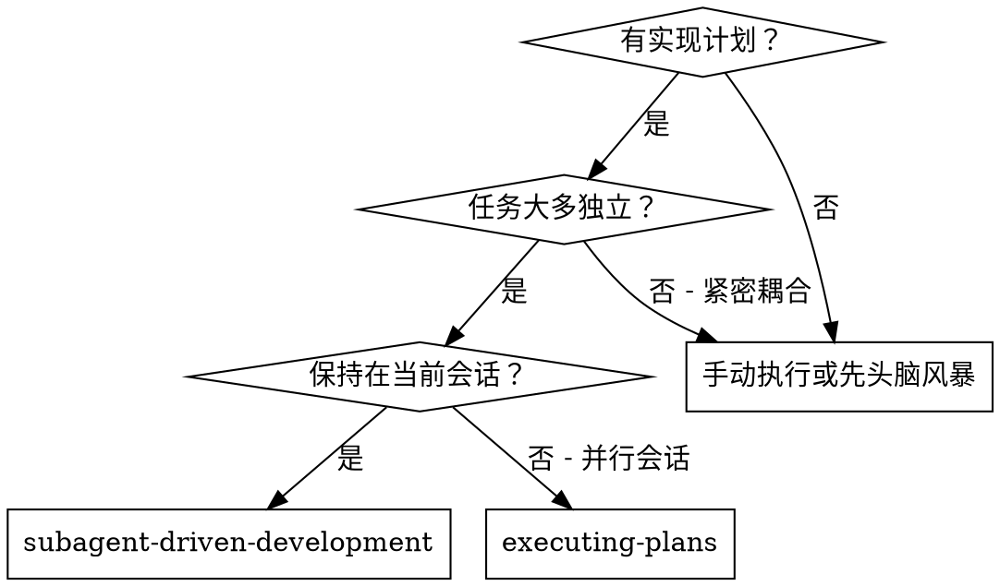
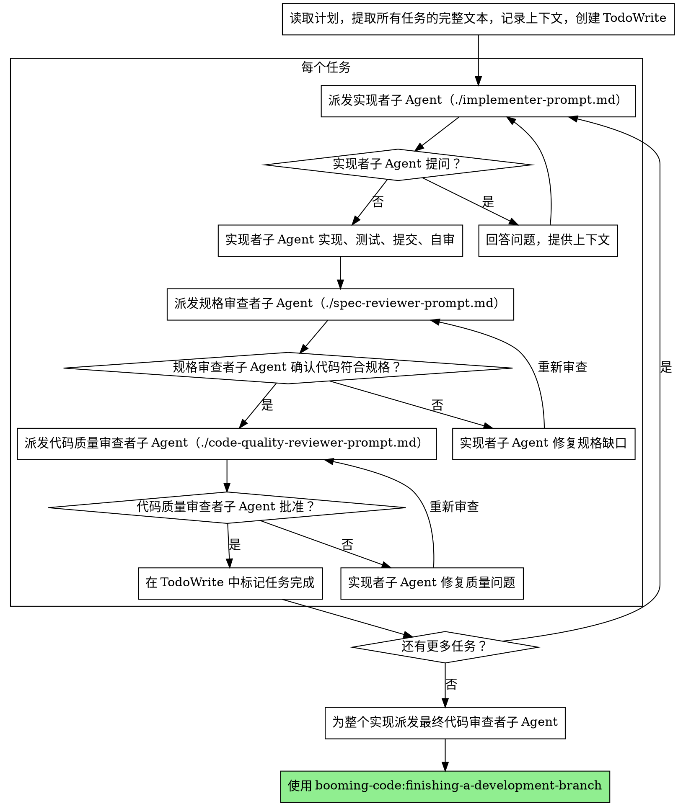

# 子 Agent 驱动开发

通过为每个任务派发新鲜子 Agent 来执行计划，每个任务完成后进行两阶段审查：先进行规格合规性审查，再进行代码质量审查。

**为什么使用子 Agent：** 你将任务委托给具有隔离上下文的专业 Agent。通过精心构建他们的指令和上下文，确保他们保持专注并成功完成任务。他们绝不应该继承你的会话上下文或历史——你精确构建他们所需的一切。这也为你自己的协调工作保留了上下文。

**核心原则：** 每个任务使用新鲜子 Agent + 两阶段审查（规格合规性然后代码质量）= 高质量、快速迭代

## 使用时机



**与 Executing Plans（并行会话）的对比：**
- 同一会话（无上下文切换）
- 每个任务使用新鲜子 Agent（无上下文污染）
- 每个任务完成后两阶段审查：先规格合规性，后代码质量
- 更快的迭代（任务之间无需人工介入）

## 流程



## 模型选择

使用能够处理每个角色的最低效能模型，以节省成本并提高速度。

**机械性实现任务**（隔离函数、清晰规格、1-2 个文件）：使用快速廉价的模型。当计划详细时，大多数实现任务是机械性的。

**集成和判断任务**（多文件协调、模式匹配、调试）：使用标准模型。

**架构、设计和审查任务**：使用最强大的可用模型。

**任务复杂度信号：**
- 触及 1-2 个文件且有完整规格 → 廉价模型
- 触及多个文件且有集成问题 → 标准模型
- 需要设计判断或广泛的代码库理解 → 最强大的模型

## 处理实现者状态

实现者子 Agent 报告四种状态之一。适当处理每种情况：

**DONE：** 继续进行规格合规性审查。

**DONE_WITH_CONCERNS：** 实现者完成了工作但标记了疑虑。在继续前阅读这些疑虑。如果疑虑关于正确性或范围，在审查前解决它们。如果只是观察（例如"这个文件越来越大"），记录下来并继续审查。

**NEEDS_CONTEXT：** 实现者需要未提供的信息。提供缺失的上下文并重新派发。

**BLOCKED：** 实现者无法完成任务。评估阻塞：
1. 如果是上下文问题，提供更多上下文并用相同模型重新派发
2. 如果任务需要更多推理能力，用更强大的模型重新派发
3. 如果任务太大，拆分为更小的部分
4. 如果计划本身有误，向人类上报

**绝不**忽视上报或强迫同一模型在没有改变的情况下重试。如果实现者说卡住了，就需要改变某些东西。

## 提示模板

- `./implementer-prompt.md` - 派发实现者子 Agent
- `./spec-reviewer-prompt.md` - 派发规格合规性审查者子 Agent
- `./code-quality-reviewer-prompt.md` - 派发代码质量审查者子 Agent

## 示例工作流

```
你：我正在使用子 Agent 驱动开发来执行这个计划。

[读取计划文件一次：docs/booming/<YYYY-MM-DD>-<feature-name>/plan-<YYYY-MM-DD-HH>-<feature-name>.md]
[提取所有 5 个任务的完整文本和上下文]
[创建包含所有任务的 TodoWrite]

任务 1：Hook 安装脚本

[获取任务 1 文本和上下文（已提取）]
[派发实现子 Agent，提供完整任务文本 + 上下文]

实现者："开始之前——hook 应该安装在用户级还是系统级？"

你："用户级（~/.config/booming/hooks/）"

实现者："明白了。正在实现..."
[稍后] 实现者：
  - 实现了 install-hook 命令
  - 添加了测试，5/5 通过
  - 自审：发现漏掉了 --force 标志，已添加
  - 已提交

[派发规格合规性审查者]
规格审查者：✅ 规格合规——所有要求已满足，无额外内容

[获取 git SHA，派发代码质量审查者]
代码审查者：优点：测试覆盖好，代码整洁。问题：无。已批准。

[标记任务 1 完成]

任务 2：恢复模式

[获取任务 2 文本和上下文（已提取）]
[派发实现子 Agent，提供完整任务文本 + 上下文]

实现者：[无问题，直接开始]
实现者：
  - 添加了 verify/repair 模式
  - 8/8 测试通过
  - 自审：一切正常
  - 已提交

[派发规格合规性审查者]
规格审查者：❌ 问题：
  - 缺失：进度报告（规格说明"每 100 项报告一次"）
  - 多余：添加了 --json 标志（未被请求）

[实现者修复问题]
实现者：移除了 --json 标志，添加了进度报告

[规格审查者再次审查]
规格审查者：✅ 现在规格合规

[派发代码质量审查者]
代码审查者：优点：扎实。问题（重要）：魔术数字（100）

[实现者修复]
实现者：提取了 PROGRESS_INTERVAL 常量

[代码审查者再次审查]
代码审查者：✅ 已批准

[标记任务 2 完成]

...

[所有任务完成后]
[派发最终代码审查者]
最终审查者：所有要求已满足，可以合并

完成！
```

## 优势

**与手动执行相比：**
- 子 Agent 自然遵循 TDD
- 每个任务上下文清晰（无混淆）
- 并行安全（子 Agent 互不干扰）
- 子 Agent 可以提问（工作前后都可以）

**与 Executing Plans 相比：**
- 同一会话（无交接）
- 持续进展（无需等待）
- 审查检查点自动触发

**效率提升：**
- 无文件读取开销（控制器提供完整文本）
- 控制器精确筛选所需上下文
- 子 Agent 预先获得完整信息
- 问题在工作开始前（而非之后）被发现

**质量关卡：**
- 自审在交接前发现问题
- 两阶段审查：规格合规性，然后代码质量
- 审查循环确保修复实际有效
- 规格合规性防止过度或不足构建
- 代码质量确保实现构建良好

**成本：**
- 更多子 Agent 调用（每个任务：实现者 + 2 个审查者）
- 控制器需要更多准备工作（预先提取所有任务）
- 审查循环增加迭代次数
- 但能早期发现问题（比后期调试更便宜）

## 红旗

**绝不：**
- 未经用户明确同意在 main/master 分支上开始实现
- 跳过审查（规格合规性或代码质量都不能跳过）
- 带着未修复的问题继续
- 并行派发多个实现子 Agent（会产生冲突）
- 让子 Agent 读取计划文件（改为提供完整文本）
- 跳过场景设置上下文（子 Agent 需要了解任务的位置）
- 忽视子 Agent 的问题（在让他们继续之前回答）
- 在规格合规性上接受"差不多"（规格审查者发现问题 = 未完成）
- 跳过审查循环（审查者发现问题 = 实现者修复 = 再次审查）
- 让实现者自审替代实际审查（两者都需要）
- **在规格合规性 ✅ 之前开始代码质量审查**（顺序错误）
- 在任一审查有未解决问题时转移到下一任务

**如果子 Agent 提问：**
- 清晰完整地回答
- 必要时提供额外上下文
- 不要催促他们进入实现阶段

**如果审查者发现问题：**
- 实现者（同一子 Agent）修复问题
- 审查者再次审查
- 重复直到批准
- 不要跳过重新审查

**如果子 Agent 任务失败：**
- 派发有具体指令的修复子 Agent
- 不要手动修复（会污染上下文）

## 集成

**必需的工作流技能：**
- **booming-code:using-git-worktrees** - 必需：开始前设置隔离的工作空间
- **booming-code:writing-plans** - 创建本技能执行的计划
- **booming-code:requesting-code-review** - 审查者子 Agent 的代码审查模板
- **booming-code:finishing-a-development-branch** - 所有任务完成后收尾开发工作

**子 Agent 应使用：**
- **booming-code:test-driven-development** - 子 Agent 对每个任务遵循 TDD

**替代工作流：**
- **booming-code:executing-plans** - 用于并行会话而非同一会话执行
