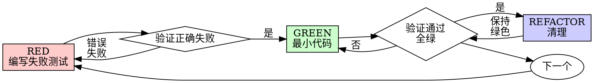

# 测试驱动开发（TDD）

## 概述

先写测试。看它失败。写最小代码让它通过。

**核心原则：** 如果你没有看到测试失败，你不知道它是否测试了正确的东西。

**违反规则的字面规定就是违反了规则的精神。**

## 使用时机

**始终：**
- 新功能
- Bug 修复
- 重构
- 行为变更

**例外情况（询问 your human partner）：**
- 一次性原型
- 生成的代码
- 配置文件

在想"这次就跳过 TDD"吗？停下来。那是合理化。

## 铁律

```
在有失败测试之前，不得编写生产代码
```

在测试之前写了代码？删除它。重新开始。

**没有例外：**
- 不要将其保留为"参考"
- 不要在编写测试时"适应"它
- 不要看它
- 删除就是删除

从测试全新实现。就这样。

## Red-Green-Refactor



### RED - 编写失败测试

写一个最小测试来展示应该发生什么。

<Good>
```typescript
test('retries failed operations 3 times', async () => {
  let attempts = 0;
  const operation = () => {
    attempts++;
    if (attempts < 3) throw new Error('fail');
    return 'success';
  };

  const result = await retryOperation(operation);

  expect(result).toBe('success');
  expect(attempts).toBe(3);
});
```
清晰的名称，测试真实行为，测试单一事项
</Good>

<Bad>
```typescript
test('retry works', async () => {
  const mock = jest.fn()
    .mockRejectedValueOnce(new Error())
    .mockRejectedValueOnce(new Error())
    .mockResolvedValueOnce('success');
  await retryOperation(mock);
  expect(mock).toHaveBeenCalledTimes(3);
});
```
模糊的名称，测试模拟而非代码
</Bad>

**要求：**
- 测试单一行为
- 清晰的名称
- 真实代码（除非不可避免否则不使用模拟）

### 验证 RED - 看它失败

**强制性。绝不跳过。**

```bash
npm test path/to/test.test.ts
```

确认：
- 测试失败（不是错误）
- 失败消息符合预期
- 因为功能缺失而失败（不是因为拼写错误）

**测试通过了？** 你在测试现有行为。修复测试。

**测试报错了？** 修复错误，重新运行直到正确失败。

### GREEN - 最小代码

写最简单的代码让测试通过。

<Good>
```typescript
async function retryOperation<T>(fn: () => Promise<T>): Promise<T> {
  for (let i = 0; i < 3; i++) {
    try {
      return await fn();
    } catch (e) {
      if (i === 2) throw e;
    }
  }
  throw new Error('unreachable');
}
```
刚好足够通过
</Good>

<Bad>
```typescript
async function retryOperation<T>(
  fn: () => Promise<T>,
  options?: {
    maxRetries?: number;
    backoff?: 'linear' | 'exponential';
    onRetry?: (attempt: number) => void;
  }
): Promise<T> {
  // YAGNI
}
```
过度设计
</Bad>

不要添加功能，不要重构其他代码，也不要在测试范围之外"改进"。

### 验证 GREEN - 看它通过

**强制性。**

```bash
npm test path/to/test.test.ts
```

确认：
- 测试通过
- 其他测试仍然通过
- 输出干净（无错误、警告）

**测试失败？** 修复代码，而非测试。

**其他测试失败？** 现在修复。

### REFACTOR - 清理

仅在绿色之后：
- 删除重复
- 改善名称
- 提取辅助函数

保持测试绿色。不要添加行为。

### 重复

为下一个功能编写下一个失败测试。

## 好的测试

| 质量 | 好的 | 不好的 |
|------|------|--------|
| **最小化** | 一件事。名称中有"and"？拆分它。 | `test('validates email and domain and whitespace')` |
| **清晰** | 名称描述行为 | `test('test1')` |
| **展示意图** | 演示期望的 API | 模糊代码应该做什么 |

## 顺序为何重要

**"我会在之后写测试来验证它有效"**

在代码之后写的测试立即通过。立即通过什么都证明不了：
- 可能测试了错误的事情
- 可能测试了实现而非行为
- 可能遗漏了你忘记的边缘情况
- 你从未看到它捕获 bug

先写测试迫使你看到测试失败，证明它确实在测试某些东西。

**"我已经手动测试了所有边缘情况"**

手动测试是临时性的。你认为你测试了所有东西，但：
- 没有测试内容的记录
- 代码更改时无法重新运行
- 在压力下容易忘记情况
- "我试过时它起了作用" ≠ 全面

自动化测试是系统性的。每次运行方式相同。

**"删除 X 小时的工作是浪费的"**

沉没成本谬误。时间已经过去了。你现在的选择：
- 删除并用 TDD 重写（再多 X 小时，高信心）
- 保留并在之后添加测试（30 分钟，低信心，可能有 bug）

"浪费"是保留你无法信任的代码。没有真实测试的有效代码是技术债务。

**"TDD 是教条主义的，务实意味着适应"**

TDD 确实是务实的：
- 在提交之前发现 bug（比之后调试更快）
- 防止回归（测试立即捕获中断）
- 记录行为（测试展示如何使用代码）
- 支持重构（自由更改，测试捕获中断）

"务实"的捷径 = 在生产中调试 = 更慢。

**"后写的测试实现了相同的目标——这是精神而非仪式"**

不。后写测试回答"这做什么？"先写测试回答"这应该做什么？"

后写测试被你的实现所偏向。你测试了你构建的，而非所需的。你验证了记忆中的边缘情况，而非发现的边缘情况。

先写测试在实现之前强制发现边缘情况。后写测试验证你记住了所有东西（你没有）。

30 分钟的后写测试 ≠ TDD。你获得覆盖率，失去测试有效的证明。

## 常见合理化

| 借口 | 现实 |
|------|------|
| "太简单了，不需要测试" | 简单代码也会出错。测试只需 30 秒。 |
| "我会在之后测试" | 立即通过的测试什么都证明不了。 |
| "后写测试实现相同目标" | 后写测试 = "这做什么？" 先写测试 = "这应该做什么？" |
| "已经手动测试了" | 临时性 ≠ 系统性。无记录，无法重新运行。 |
| "删除 X 小时是浪费的" | 沉没成本谬误。保留未验证的代码是技术债务。 |
| "保留为参考，先写测试" | 你会适应它。那就是后写测试。删除就是删除。 |
| "需要先探索" | 可以。丢弃探索，从 TDD 开始。 |
| "测试困难 = 设计不清晰" | 倾听测试。难以测试 = 难以使用。 |
| "TDD 会让我慢下来" | TDD 比调试更快。务实 = 先测试。 |
| "手动测试更快" | 手动不能证明边缘情况。每次变更都要重新测试。 |
| "现有代码没有测试" | 你在改进它。为现有代码添加测试。 |

## 红旗——停下来重新开始

- 测试前写了代码
- 实现后写了测试
- 测试立即通过
- 无法解释测试为何失败
- 测试被"稍后"添加
- 合理化"就这一次"
- "我已经手动测试了"
- "后写测试实现相同目的"
- "这是精神而非仪式"
- "保留为参考"或"适应现有代码"
- "已经花了 X 小时，删除是浪费的"
- "TDD 是教条主义的，我在务实"
- "这种情况不同，因为..."

**所有这些都意味着：删除代码。用 TDD 重新开始。**

## 示例：Bug 修复

**Bug：** 接受了空电子邮件

**RED**
```typescript
test('rejects empty email', async () => {
  const result = await submitForm({ email: '' });
  expect(result.error).toBe('Email required');
});
```

**验证 RED**
```bash
$ npm test
FAIL: expected 'Email required', got undefined
```

**GREEN**
```typescript
function submitForm(data: FormData) {
  if (!data.email?.trim()) {
    return { error: 'Email required' };
  }
  // ...
}
```

**验证 GREEN**
```bash
$ npm test
PASS
```

**REFACTOR**
如果需要，为多个字段提取验证。

## 验证清单

标记工作完成前：

- [ ] 每个新函数/方法都有测试
- [ ] 在实现之前看到每个测试失败
- [ ] 每个测试因预期原因失败（功能缺失，而非拼写错误）
- [ ] 为每个测试写了最小代码
- [ ] 所有测试通过
- [ ] 输出干净（无错误、警告）
- [ ] 测试使用真实代码（仅在不可避免时才使用模拟）
- [ ] 覆盖了边缘情况和错误

无法勾选所有项？你跳过了 TDD。重新开始。

## 卡住时

| 问题 | 解决方案 |
|------|---------|
| 不知道如何测试 | 写出期望的 API。先写断言。询问 your human partner。 |
| 测试太复杂 | 设计太复杂。简化接口。 |
| 必须模拟一切 | 代码耦合太紧。使用依赖注入。 |
| 测试设置很庞大 | 提取辅助函数。还是复杂？简化设计。 |

## 调试集成

发现 bug？写一个重现它的失败测试。遵循 TDD 循环。测试证明了修复并防止回归。

永远不要在没有测试的情况下修复 bug。

## 测试反模式

添加模拟或测试工具时，阅读 @testing-anti-patterns.md 以避免常见陷阱：
- 测试模拟行为而非真实行为
- 向生产类添加仅用于测试的方法
- 在不理解依赖关系的情况下进行模拟

## 最终规则

```
生产代码 → 测试存在且先失败
否则 → 不是 TDD
```

未经 your human partner 许可，没有例外。
