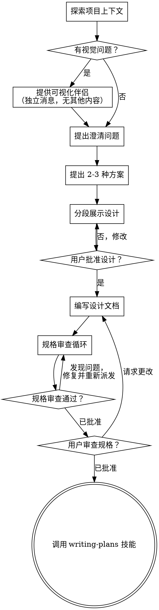

# 将想法转化为设计

通过自然的协作对话，帮助将想法转化为完整的设计和规格说明。

从理解当前项目上下文开始，逐一提问以细化想法。一旦理解了你要构建的内容，展示设计并获得用户批准。

<HARD-GATE>
在你展示设计并且用户批准之前，不要调用任何实现技能、编写任何代码、搭建任何项目或采取任何实现行动。这适用于每个项目，无论其看起来多么简单。
</HARD-GATE>

## 反模式："这太简单了，不需要设计"

每个项目都要经过这个流程。待办事项列表、单函数工具、配置变更——都一样。"简单"项目恰恰是未经审查的假设造成最多无效工作的地方。设计可以很简短（对于真正简单的项目只需几句话），但你必须展示它并获得批准。

## 检查清单

你必须为以下每个事项创建一个任务，并按顺序完成：

1. **探索项目上下文** — 检查文件、文档、最近的提交
2. **提供可视化伴侣**（如果主题涉及视觉问题）— 这是独立的消息，不与澄清问题合并。见下方可视化伴侣章节。
3. **提出澄清问题** — 一次一个，了解目的/约束/成功标准
4. **提出 2-3 种方案** — 附带权衡分析和你的推荐
5. **展示设计** — 按复杂度分段展示，每段后获得用户批准
6. **编写设计文档** — 保存到 `docs/booming/<YYYY-MM-DD>-<feature-name>/design-<YYYY-MM-DD-HH>-<feature-name>.md` 并提交
7. **规格审查循环** — 派发规格文档审查者子 Agent，提供精心构建的审查上下文（绝不使用你的会话历史）；修复问题并重新派发直到批准（最多 5 次迭代，然后向人类寻求指导）
8. **用户审查已写规格** — 在继续之前请用户审查规格文件
9. **过渡到实现** — 调用 writing-plans 技能来创建实现计划

## 流程图

**终态是调用 writing-plans。** 不要调用 frontend-design、mcp-builder 或任何其他实现技能。brainstorming 之后你唯一调用的技能是 writing-plans。

## 流程

**理解想法：**

- 首先检查当前项目状态（文件、文档、最近提交）
- 在提出详细问题之前，评估范围：如果请求描述了多个独立子系统（例如"构建一个包含聊天、文件存储、计费和分析的平台"），立即指出。不要花时间细化一个需要先分解的项目的细节。
- 如果项目太大无法用单一规格说明，帮助用户分解为子项目：有哪些独立部分，它们如何关联，应该按什么顺序构建？然后通过正常设计流程对第一个子项目进行头脑风暴。每个子项目有自己的规格 → 计划 → 实现周期。
- 对于范围合适的项目，逐一提问以细化想法
- 尽可能使用选择题，开放式问题也可以
- 每条消息只问一个问题——如果某个主题需要更多探索，将其拆分为多个问题
- 专注于理解：目的、约束、成功标准

**探索方案：**

- 提出 2-3 种不同方案附带权衡分析
- 以对话方式展示选项，附带你的推荐和理由
- 以你推荐的选项为主并解释原因

**展示设计：**

- 一旦你认为理解了要构建的内容，展示设计
- 根据复杂度调整每个部分的规模：如果简单明了则几句话，如果复杂则最多 200-300 字
- 每个部分后询问到目前为止是否看起来正确
- 涵盖：架构、组件、数据流、错误处理、测试
- 当某些内容不合理时，随时准备回头澄清

**为隔离性和清晰性设计：**

- 将系统分解为各自有一个明确目的的较小单元，通过定义良好的接口通信，可以独立理解和测试
- 对于每个单元，你应该能够回答：它做什么、如何使用它、它依赖什么？
- 有人能不阅读其内部实现就理解单元的功能吗？你能在不破坏使用者的情况下改变内部实现吗？如果不能，边界需要调整。
- 较小的、边界清晰的单元对你来说也更容易处理——你对能一次性在脑中持有的代码推理更好，当文件专注时你的编辑也更可靠。当文件变大时，这通常是它做了太多事情的信号。

**在现有代码库中工作：**

- 在提出变更之前先探索当前结构。遵循现有模式。
- 当现有代码存在影响工作的问题时（例如，文件变得太大、边界不清晰、职责纠缠），将针对性的改进纳入设计——就像好的开发者改善他们正在工作的代码一样。
- 不要提议无关的重构。保持专注于当前目标。

## 设计完成后

**文档：**

- 将经过验证的设计（规格）写入 `docs/booming/<YYYY-MM-DD>-<feature-name>/design-<YYYY-MM-DD-HH>-<feature-name>.md`
  - （用户对规格位置的偏好覆盖此默认值）
- 如果可用，使用 elements-of-style:writing-clearly-and-concisely 技能
- 将设计文档提交到 git

**规格审查循环：**
编写规格文档后：

1. 派发规格文档审查者子 Agent（见 spec-document-reviewer-prompt.md）
2. 如果发现问题：修复、重新派发，重复直到批准
3. 如果循环超过 5 次迭代，向人类寻求指导

**用户审查门：**
规格审查循环通过后，在继续之前请用户审查已写规格：

> "规格已写入并提交到 `<path>`。请审查它，如果在开始编写实现计划之前想做任何更改，请告知。"

等待用户回应。如果他们请求更改，进行更改并重新运行规格审查循环。只有在用户批准后才继续。

**实现：**

- 调用 writing-plans 技能来创建详细的实现计划
- 不要调用任何其他技能。writing-plans 是下一步。

## 核心原则

- **一次一个问题** - 不要用多个问题淹没用户
- **优先选择题** - 比开放式问题更容易回答
- **无情地应用 YAGNI** - 从所有设计中删除不必要的功能
- **探索替代方案** - 在确定之前始终提出 2-3 种方案
- **增量验证** - 展示设计，在继续前获得批准
- **保持灵活** - 当某些内容不合理时，回头澄清

## 可视化伴侣

一个基于浏览器的伴侣，用于在头脑风暴期间展示原型、图表和视觉选项。作为工具提供——而非模式。接受伴侣意味着它可用于受益于视觉处理的问题；并不意味着每个问题都通过浏览器进行。

**提供伴侣：** 当你预计即将到来的问题会涉及视觉内容（原型、布局、图表）时，为获得同意提供一次：
> "我们正在处理的某些内容，如果我能在网页浏览器中向你展示可能更容易解释。在我们进行时，我可以制作原型、图表、比较和其他视觉内容。此功能仍然较新，可能会消耗较多 token。想试试吗？（需要打开本地 URL）"

**这个提供必须是独立的消息。** 不要与澄清问题、上下文摘要或任何其他内容合并。消息应该只包含上面的提供内容，别无其他。在继续之前等待用户回应。如果他们拒绝，进行纯文本头脑风暴。

**逐问题决策：** 即使在用户接受后，也要为每个问题决定是使用浏览器还是终端。测试：**用户看到它是否比读到它更容易理解？**

- **使用浏览器** 处理视觉内容——原型、线框图、布局比较、架构图、并排视觉设计
- **使用终端** 处理文字内容——需求问题、概念选择、权衡列表、A/B/C/D 文字选项、范围决策

关于 UI 主题的问题不自动是视觉问题。"这个上下文中个性是什么意思？"是概念性问题——使用终端。"哪种向导布局更好？"是视觉问题——使用浏览器。

如果他们同意使用伴侣，在继续之前阅读详细指南：
`skills/dev-brainstorm/visual-companion.md`
