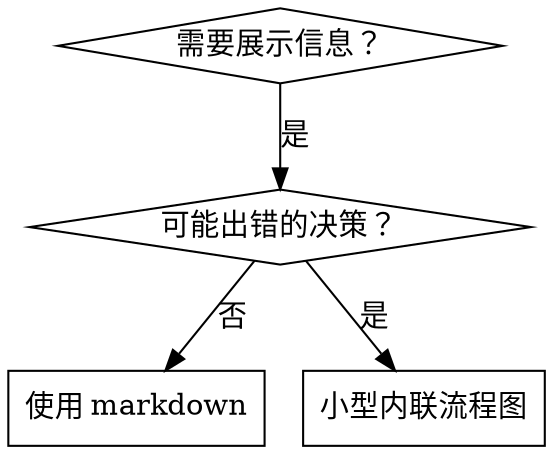

# 编写技能

## 概述

**编写技能就是将测试驱动开发应用于流程文档。**

**个人技能存放在特定于 agent 的目录中（Claude Code 为 `~/.claude/skills`，Codex 为 `~/.agents/skills/`）**

你编写测试用例（带子 agents 的压力场景），看它们失败（基准行为），编写技能（文档），看测试通过（agents 遵守），然后重构（封堵漏洞）。

**核心原则：** 如果你没有看到 agent 在没有技能的情况下失败，你不知道技能是否教了正确的东西。

**必需背景：** 在使用本技能之前，你必须理解 booming-code:test-driven-development。该技能定义了基本的 RED-GREEN-REFACTOR 循环。本技能将 TDD 适配到文档。

**官方指南：** 关于 Anthropic 官方的技能编写最佳实践，见 anthropic-best-practices.md。本文档提供了补充 TDD 方法的额外模式和指导。

## 什么是技能？

**技能**是经过验证的技术、模式或工具的参考指南。技能帮助未来的 Claude 实例找到并应用有效的方法。

**技能是：** 可复用的技术、模式、工具、参考指南

**技能不是：** 关于你某次解决问题的叙述

## 技能的 TDD 映射

| TDD 概念 | 技能创建 |
|---------|---------|
| **测试用例** | 带子 agent 的压力场景 |
| **生产代码** | 技能文档（SKILL.md） |
| **测试失败（RED）** | 没有技能时 agent 违反规则（基准） |
| **测试通过（GREEN）** | 技能存在时 agent 遵守 |
| **重构** | 在保持合规的同时封堵漏洞 |
| **先写测试** | 在写技能之前运行基准场景 |
| **看它失败** | 记录 agent 使用的确切合理化 |
| **最小代码** | 编写解决那些特定违规的技能 |
| **看它通过** | 验证 agent 现在遵守 |
| **重构循环** | 找新合理化 → 封堵 → 重新验证 |

整个技能创建过程遵循 RED-GREEN-REFACTOR。

## 何时创建技能

**以下情况创建：**
- 技术对你来说不是直觉上明显的
- 你会在不同项目中再次参考这个
- 模式广泛适用（非项目特定）
- 其他人会从中受益

**以下情况不要创建：**
- 一次性解决方案
- 其他地方有充分文档的标准实践
- 项目特定惯例（放在 CLAUDE.md 中）
- 机械性约束（如果可以用正则/验证强制执行，就自动化——将文档留给判断调用）

## 技能类型

### 技术
有步骤可遵循的具体方法（condition-based-waiting、root-cause-tracing）

### 模式
思考问题的方式（flatten-with-flags、test-invariants）

### 参考
API 文档、语法指南、工具文档（office docs）

## 目录结构

```
skills/
  skill-name/
    SKILL.md              # 主要参考（必需）
    supporting-file.*     # 仅在需要时
```

**平面命名空间** - 所有技能在一个可搜索的命名空间中

**为以下内容使用单独文件：**
1. **大量参考**（100+ 行）- API 文档、综合语法
2. **可复用工具** - 脚本、工具、模板

**保持内联：**
- 原则和概念
- 代码模式（< 50 行）
- 其他所有内容

## SKILL.md 结构

**前置元数据（YAML）：**
- 只支持两个字段：`name` 和 `description`
- 最多 1024 个字符
- `name`：只使用字母、数字和连字符（无括号、特殊字符）
- `description`：第三人称，只描述何时使用（不是它做什么）
  - 以"Use when..."开头以专注于触发条件
  - 包含具体症状、情况和上下文
  - **永远不要总结技能的流程或工作流**（见 CSO 章节了解原因）
  - 如果可能，保持在 500 个字符以下

```markdown
---
name: Skill-Name-With-Hyphens
description: Use when [specific triggering conditions and symptoms]
---

# 技能名称

## 概述
这是什么？1-2 句话的核心原则。

## 使用时机
[如果决策不明显则使用小型内联流程图]

症状和用例的要点列表
不使用的情况

## 核心模式（对于技术/模式）
代码前后比较

## 快速参考
扫描常见操作的表格或要点

## 实现
简单模式的内联代码
重量级参考或可复用工具链接到文件

## 常见错误
出什么问题 + 修复

## 实际影响（可选）
具体结果
```

## Claude 搜索优化（CSO）

**对发现至关重要：** 未来的 Claude 需要能够找到你的技能

### 1. 丰富的描述字段

**目的：** Claude 读取描述来决定为给定任务加载哪些技能。让它回答："我现在应该读这个技能吗？"

**格式：** 以"Use when..."开头以专注于触发条件

**关键：描述 = 使用时机，而非技能做什么**

描述应该只描述触发条件。不要在描述中总结技能的流程或工作流。

**为什么这很重要：** 测试揭示，当描述总结技能的工作流时，Claude 可能会遵循描述而不是阅读完整技能内容。一个描述说"任务之间进行代码审查"的描述导致 Claude 只做一次审查，即使技能的流程图清楚地显示了两次审查（先规格合规性，后代码质量）。

当描述更改为只是"在当前会话中执行具有独立任务的实现计划时使用"（无工作流摘要）时，Claude 正确地读取了流程图并遵循了两阶段审查流程。

**陷阱：** 总结工作流的描述创建了 Claude 会走的捷径。技能主体变成了 Claude 跳过的文档。

```yaml
# ❌ 不好：总结工作流——Claude 可能遵循这个而不是读取技能
description: Use when executing plans - dispatches subagent per task with code review between tasks

# ❌ 不好：太多流程细节
description: Use for TDD - write test first, watch it fail, write minimal code, refactor

# ✅ 好：只是触发条件，无工作流摘要
description: Use when executing implementation plans with independent tasks in the current session

# ✅ 好：只有触发条件
description: Use when implementing any feature or bugfix, before writing implementation code
```

**内容：**
- 使用信号此技能适用的具体触发器、症状和情况
- 描述*问题*（竞态条件、不一致行为）而非*语言特定症状*（setTimeout、sleep）
- 保持触发器与技术无关，除非技能本身是技术特定的
- 如果技能是技术特定的，在触发器中明确说明
- 以第三人称书写（注入到系统提示中）
- **永远不要总结技能的流程或工作流**

### 2. 关键词覆盖

使用 Claude 会搜索的词：
- 错误消息："Hook timed out"、"ENOTEMPTY"、"race condition"
- 症状："flaky"、"hanging"、"zombie"、"pollution"
- 同义词："timeout/hang/freeze"、"cleanup/teardown/afterEach"
- 工具：实际命令、库名称、文件类型

### 3. 描述性命名

**使用主动语态、动词优先：**
- ✅ `creating-skills` 而非 `skill-creation`
- ✅ `condition-based-waiting` 而非 `async-test-helpers`

### 4. Token 效率（关键）

**问题：** 入门和常用技能加载到每次对话中。每个 token 都很重要。

**目标字数：**
- 入门工作流：各 <150 字
- 常用技能：总计 <200 字
- 其他技能：<500 字（仍要简洁）

**技术：**

**将细节移到工具帮助中：**
```bash
# ❌ 不好：在 SKILL.md 中记录所有标志
search-conversations supports --text, --both, --after DATE, --before DATE, --limit N

# ✅ 好：引用 --help
search-conversations supports multiple modes and filters. Run --help for details.
```

**使用交叉引用：**
```markdown
# ❌ 不好：重复工作流细节
When searching, dispatch subagent with template...
[20 lines of repeated instructions]

# ✅ 好：引用其他技能
Always use subagents (50-100x context savings). REQUIRED: Use [other-skill-name] for workflow.
```

**压缩示例：**
```markdown
# ❌ 不好：冗长示例（42 字）
your human partner: "How did we handle authentication errors in React Router before?"
You: I'll search past conversations for React Router authentication patterns.

# ✅ 好：最小示例（20 字）
Partner: "How did we handle auth errors in React Router?"
You: Searching...
[Dispatch subagent → synthesis]
```

**消除冗余：**
- 不要重复交叉引用技能中的内容
- 不要解释从命令中显而易见的内容
- 不要包含相同模式的多个示例

### 4. 交叉引用其他技能

**在引用其他技能的文档中：**

只使用技能名称，带有明确的要求标记：
- ✅ 好：`**必需子技能：** 使用 booming-code:test-driven-development`
- ✅ 好：`**必需背景：** 你必须理解 booming-code:systematic-debugging`
- ❌ 不好：`见 skills/testing/test-driven-development`（不清楚是否必需）
- ❌ 不好：`@skills/testing/test-driven-development/SKILL.md`（强制加载，消耗上下文）

**为什么不用 @ 链接：** `@` 语法立即强制加载文件，在你需要之前消耗 200k+ 上下文。

## 流程图使用



**只在以下情况使用流程图：**
- 非明显的决策点
- 可能过早停止的流程循环
- "何时使用 A vs B"的决策

**永远不要将流程图用于：**
- 参考材料 → 表格、列表
- 代码示例 → Markdown 块
- 线性指令 → 编号列表
- 没有语义含义的标签（step1、helper2）

**为 your human partner 可视化：** 使用本目录中的 `render-graphs.js` 将技能的流程图渲染为 SVG：
```bash
./render-graphs.js ../some-skill           # 每个图表单独
./render-graphs.js ../some-skill --combine # 所有图表在一个 SVG 中
```

## 代码示例

**一个优秀示例胜过许多平庸的**

选择最相关的语言：
- 测试技术 → TypeScript/JavaScript
- 系统调试 → Shell/Python
- 数据处理 → Python

**好的示例：**
- 完整且可运行
- 注释良好，解释为什么
- 来自真实场景
- 清楚展示模式
- 准备好适配（非通用模板）

**不要：**
- 用 5+ 种语言实现
- 创建填空模板
- 写人为的示例

你擅长移植——一个好的示例就足够了。

## 文件组织

### 自包含技能
```
defense-in-depth/
  SKILL.md    # 所有内容内联
```
适用时：所有内容适合放入，不需要大量参考

### 带可复用工具的技能
```
condition-based-waiting/
  SKILL.md    # 概述 + 模式
  example.ts  # 可适配的工作辅助函数
```
适用时：工具是可复用代码，而非只是叙述

### 带大量参考的技能
```
pptx/
  SKILL.md       # 概述 + 工作流
  pptxgenjs.md   # 600 行 API 参考
  ooxml.md       # 500 行 XML 结构
  scripts/       # 可执行工具
```
适用时：参考材料太大，无法内联

## 铁律（与 TDD 相同）

```
在有失败测试之前，不得编写技能
```

这适用于新技能和对现有技能的编辑。

在测试之前写了技能？删除它。重新开始。
在没有测试的情况下编辑技能？同样的违规。

**无例外：**
- 不是为了"简单添加"
- 不是为了"只是添加一个章节"
- 不是为了"文档更新"
- 不要将未经测试的更改保留为"参考"
- 不要在运行测试时"适应"
- 删除就是删除

**必需背景：** booming-code:test-driven-development 技能解释了为什么这很重要。相同原则适用于文档。

## 测试所有技能类型

不同的技能类型需要不同的测试方法：

### 纪律执行技能（规则/要求）

**示例：** TDD、verification-before-completion、designing-before-coding

**测试用：**
- 学术问题：他们理解规则吗？
- 压力场景：他们在压力下遵守吗？
- 多重压力组合：时间 + 沉没成本 + 疲惫
- 识别合理化并添加明确反制

**成功标准：** agent 在最大压力下遵守规则

### 技术技能（操作指南）

**示例：** condition-based-waiting、root-cause-tracing、defensive-programming

**测试用：**
- 应用场景：他们能正确应用技术吗？
- 变体场景：他们处理边缘情况了吗？
- 缺失信息测试：指令有缺口吗？

**成功标准：** agent 成功将技术应用到新场景

### 模式技能（心智模型）

**示例：** reducing-complexity、information-hiding 概念

**测试用：**
- 识别场景：他们能识别模式何时适用吗？
- 应用场景：他们能使用心智模型吗？
- 反例：他们知道何时不应用吗？

**成功标准：** agent 正确识别何时/如何应用模式

### 参考技能（文档/API）

**示例：** API 文档、命令参考、库指南

**测试用：**
- 检索场景：他们能找到正确信息吗？
- 应用场景：他们能正确使用找到的内容吗？
- 缺口测试：常见用例覆盖了吗？

**成功标准：** agent 找到并正确应用参考信息

## 跳过测试的常见合理化

| 借口 | 现实 |
|------|------|
| "技能显然很清晰" | 对你清晰 ≠ 对其他 agents 清晰。测试它。 |
| "只是参考" | 参考可能有缺口、不清晰的章节。测试检索。 |
| "测试是小题大做" | 未经测试的技能有问题。始终如此。15 分钟测试节省数小时。 |
| "出了问题我再测试" | 问题 = agents 无法使用技能。在部署之前测试。 |
| "测试太繁琐" | 测试比在生产中调试错误技能更不繁琐。 |
| "我有信心它很好" | 过度自信保证有问题。还是要测试。 |
| "学术审查就够了" | 阅读 ≠ 使用。测试应用场景。 |
| "没时间测试" | 部署未经测试的技能会在之后修复时浪费更多时间。 |

**以上所有都意味着：在部署之前测试。无例外。**

## 防止合理化的技能强化

强制执行纪律的技能（如 TDD）需要能抵抗合理化。agents 很聪明，在压力下会找到漏洞。

**心理学注意：** 理解说服技术为什么有效有助于你系统地应用它们。见 persuasion-principles.md 了解研究基础（Cialdini, 2021；Meincke et al., 2025）关于权威、承诺、稀缺性、社会证明和统一性原则。

### 明确封堵每个漏洞

不只是陈述规则——禁止具体的变通方法：

<Bad>
```markdown
在测试之前写了代码？删除它。
```
</Bad>

<Good>
```markdown
在测试之前写了代码？删除它。重新开始。

**无例外：**
- 不要将其保留为"参考"
- 不要在写测试时"适应"它
- 不要看它
- 删除就是删除
```
</Good>

### 解决"精神 vs 字面"争论

在早期添加基本原则：

```markdown
**违反规则的字面规定就是违反了规则的精神。**
```

这切断了整类"我在遵循精神"合理化。

### 建立合理化表格

从基准测试中捕获合理化（见下面的测试章节）。agents 提出的每个借口都放在表格中：

```markdown
| 借口 | 现实 |
|------|------|
| "太简单了，不需要测试" | 简单代码也会出错。测试只需 30 秒。 |
| "我会在之后测试" | 立即通过的测试什么都证明不了。 |
| "后写测试实现相同目标" | 后写测试 = "这做什么？" 先写测试 = "这应该做什么？" |
```

### 创建红旗列表

让 agents 容易自我检查是否在合理化：

```markdown
## 红旗——停下来重新开始

- 测试前写了代码
- "我已经手动测试了"
- "后写测试实现相同目的"
- "这是精神而非仪式"
- "这种情况不同，因为..."

**以上所有都意味着：删除代码。用 TDD 重新开始。**
```

### 为违规症状更新 CSO

向描述添加：你即将违反规则时的症状：

```yaml
description: use when implementing any feature or bugfix, before writing implementation code
```

## 技能的 RED-GREEN-REFACTOR

遵循 TDD 循环：

### RED：写失败测试（基准）

不带技能运行带子 agent 的压力场景。记录确切行为：
- 他们做了什么选择？
- 他们使用了什么合理化（逐字）？
- 哪些压力触发了违规？

这是"看测试失败"——你必须在写技能之前看到 agents 自然做什么。

### GREEN：写最小技能

写解决那些特定合理化的技能。不要为假设情况添加额外内容。

带技能运行相同场景。agent 现在应该遵守。

### REFACTOR：封堵漏洞

agent 找到了新合理化？添加明确反制。重新测试直到万无一失。

**测试方法：** 见 @testing-skills-with-subagents.md 了解完整测试方法：
- 如何编写压力场景
- 压力类型（时间、沉没成本、权威、疲惫）
- 系统性封堵漏洞
- 元测试技术

## 反模式

### ❌ 叙述示例
"在会话 2025-10-03 中，我们发现空 projectDir 导致..."
**为什么不好：** 太具体，不可复用

### ❌ 多语言稀释
example-js.js、example-py.py、example-go.go
**为什么不好：** 质量平庸，维护负担

### ❌ 流程图中的代码
```dot
step1 [label="import fs"];
step2 [label="read file"];
```
**为什么不好：** 无法复制粘贴，难以阅读

### ❌ 通用标签
helper1、helper2、step3、pattern4
**为什么不好：** 标签应该有语义含义

## 停止：在移到下一个技能之前

**在编写任何技能后，你必须停下来完成部署流程。**

**不要：**
- 批量创建多个技能而不测试每一个
- 在当前技能验证之前移到下一个
- 因为"批量更高效"而跳过测试

**下面的部署检查清单对每个技能都是强制性的。**

部署未经测试的技能 = 部署未经测试的代码。这是对质量标准的违反。

## 技能创建检查清单（TDD 适配）

**重要：使用 TodoWrite 为下面每个检查清单项目创建 todo。**

**RED 阶段——写失败测试：**
- [ ] 创建压力场景（纪律技能需 3+ 组合压力）
- [ ] 不带技能运行场景——逐字记录基准行为
- [ ] 识别合理化/失败中的模式

**GREEN 阶段——写最小技能：**
- [ ] 名称只使用字母、数字、连字符（无括号/特殊字符）
- [ ] 只有 name 和 description 的 YAML 前置元数据（最多 1024 字符）
- [ ] 描述以"Use when..."开头并包含具体触发器/症状
- [ ] 描述以第三人称书写
- [ ] 整个文件中有搜索关键词（错误、症状、工具）
- [ ] 带核心原则的清晰概述
- [ ] 解决 RED 中识别的特定基准失败
- [ ] 代码内联或链接到单独文件
- [ ] 一个优秀示例（非多语言）
- [ ] 带技能运行场景——验证 agents 现在遵守

**REFACTOR 阶段——封堵漏洞：**
- [ ] 识别测试中的新合理化
- [ ] 添加明确反制（如果是纪律技能）
- [ ] 从所有测试迭代中建立合理化表格
- [ ] 创建红旗列表
- [ ] 重新测试直到万无一失

**质量检查：**
- [ ] 只有在决策不明显时才有小型流程图
- [ ] 快速参考表格
- [ ] 常见错误章节
- [ ] 无叙述性故事讲述
- [ ] 只有工具或大量参考才有支持文件

**部署：**
- [ ] 将技能提交到 git 并推送到你的 fork（如果配置了）
- [ ] 考虑通过 PR 贡献回去（如果广泛有用）

## 发现工作流

未来的 Claude 如何找到你的技能：

1. **遇到问题**（"测试不稳定"）
3. **找到技能**（描述匹配）
4. **扫描概述**（这相关吗？）
5. **阅读模式**（快速参考表格）
6. **加载示例**（只有在实现时）

**为这个流程优化** - 尽早且频繁地放置可搜索的术语。

## 底线

**创建技能就是过程文档的 TDD。**

相同的铁律：没有失败测试就没有技能。
相同的循环：RED（基准）→ GREEN（写技能）→ REFACTOR（封堵漏洞）。
相同的好处：更好的质量，更少的意外，万无一失的结果。

如果你对代码遵循 TDD，就对技能遵循它。这是应用于文档的相同纪律。
